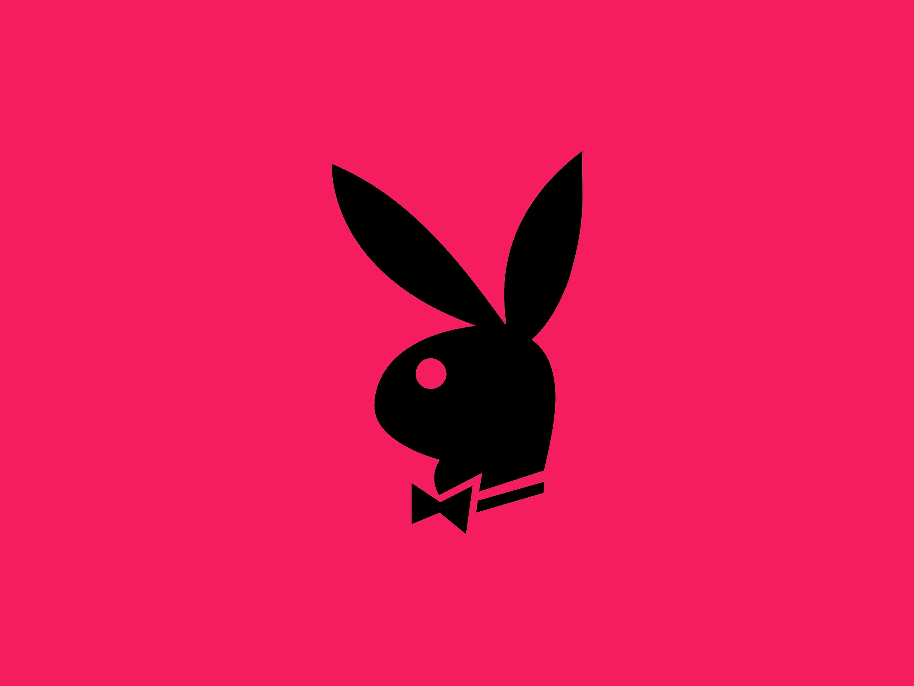

#  PLAYBOI

**PLAYBOI** — Elevate Your Sound. A vibing music player built for the modern age.

## Features
- **Vibing Interface**: Sleek, modern design for the best music experience.
- **Seamless Playback**: High-quality audio streaming and playback.
- **Smart Navigation**: Easy-to-use sidebar and top navigation.

## Getting Started

First, run the development server:

```bash
npm run dev
# or
yarn dev
# or
pnpm dev
# or
bun dev
```

Open [http://localhost:3000](http://localhost:3000) with your browser to see the result.

## Tech Stack
- **Framework**: [Next.js](https://nextjs.org)
- **Styling**: Tailwind CSS
- **Icons**: Lucide React
- **Fonts**: [Geist](https://vercel.com/font)

## Deployment

The easiest way to deploy your Next.js app is to use the [Vercel Platform](https://vercel.com/new).

Check out our [Next.js deployment documentation](https://nextjs.org/docs/app/building-your-application/deploying) for more details.
